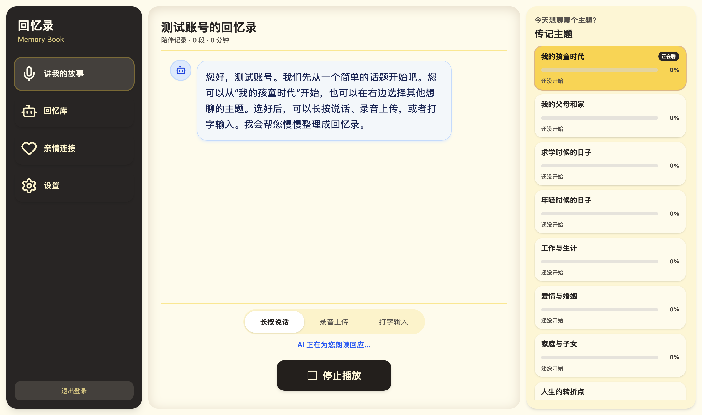
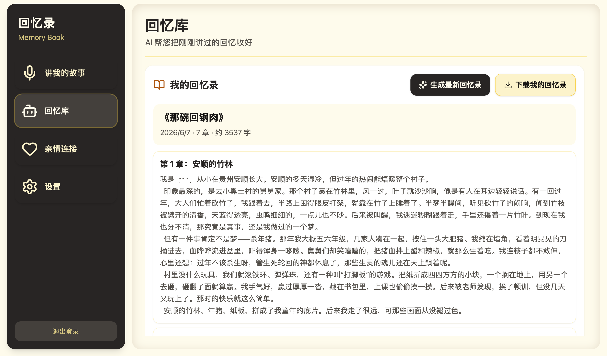
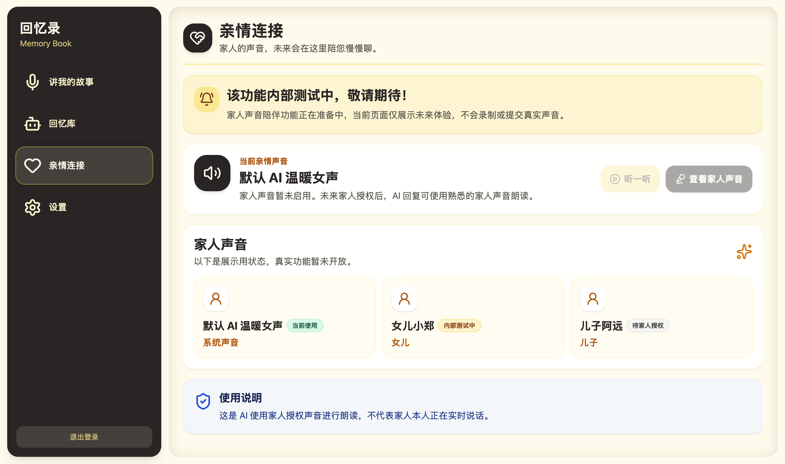

# The Beauty of Life / 故事坊

**The Beauty of Life（故事坊）** 是一个面向长辈与家庭的 AI 生命故事记录产品。

它希望通过温和的 AI 访谈、语音陪伴和回忆整理，帮助长辈把人生经历沉淀成可以被家人长期保存的自传、回忆录和家庭记忆档案。

> 这是一个公开展示仓库。  
> 项目的完整源代码、后端逻辑、数据库设计、私有 Prompt、API Key 和商业化实现暂时不会公开。

## 产品愿景

很多重要的家庭故事并不是因为不珍贵而消失，而是因为从来没有被认真记录下来。

**故事坊** 希望用更自然、更有温度的方式，陪伴长辈慢慢讲述自己的人生经历，并把这些零散的回忆整理成结构化的生命故事、人生时间线和自传材料。

这个项目关注的不只是“记录”，也关注代际之间的理解、陪伴和连接。

## 产品预览

### AI 访谈流程

AI 会以温和的方式引导长辈从不同人生主题开始讲述，例如童年、父母与家庭、求学、工作、婚姻、子女和人生转折点。

用户可以选择长按说话、录音上传或文字输入，让记录过程尽量自然、低门槛、适合长辈使用。

### 回忆库

长辈讲述过的内容会逐步沉淀进回忆库。后续这些内容可以被整理成故事片段、章节、自传草稿和家庭记忆档案。

### 亲情连接

未来版本会探索“家人声音陪伴”功能。在获得家人授权的前提下，AI 回复可以使用熟悉的家人声音进行朗读，让陪伴感更真实、更温暖。

## 核心功能

- AI 引导式人生故事访谈
- 面向长辈的友好交互设计
- 回忆主题与人生时间线整理
- 故事片段与自传内容生成
- 家庭记忆保存与亲情连接
- 未来支持书籍式导出与打印

## 在线体验

当前测试地址：[http://120.79.128.111/](http://120.79.128.111/)

该地址为早期测试环境，后续会绑定正式域名并启用 HTTPS。

## 产品演示文档

这里可以查看当前产品展示 PDF：

[查看产品演示文档](./assets/deck/The-Beauty-of-Life-Product-Deck.pdf)

## Roadmap

查看项目路线图：

[Roadmap](./docs/roadmap.md)

## 当前状态

这个仓库只用于公开展示产品方向、设计理念和阶段性界面。

目前不会包含：

- 完整前端源码
- 后端服务代码
- 数据库结构
- 私有 AI Prompt
- API Key 或环境变量
- 商业化实现细节
- 真实用户数据或真实家庭故事

## 隐私原则

故事坊涉及非常私人的人生经历、家庭记忆和亲情声音。

因此，项目会优先考虑：

- 用户知情同意
- 家庭成员授权
- 个人记忆与声音数据的隐私保护
- 对长辈表达的尊重
- 谨慎、克制、有边界的 AI 使用方式

## 作者

Created by [Zheng Yuan](https://github.com/is-aYuan)。
